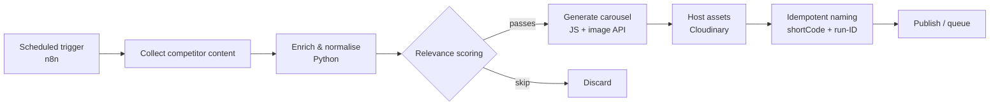

# Content Intelligence Pipeline


An automated pipeline that collects competitor content, scores it for
relevance, and generates publish-ready carousel assets. Built as a
multi-language system orchestrated in n8n, with Python for data enrichment and
scoring, and JavaScript for image generation. Containerised end to end.

This repository shows the architecture and engineering. The production scoring
model and prompt construction are proprietary and have been stubbed; the
interfaces around them are intact, and the pipeline runs end to end on bundled
sample data.

## Architecture



Full write-up in [docs/architecture.md](docs/architecture.md).

## How it works

1. A scheduled n8n trigger starts each run.
2. Collected content is passed to a Python enrichment step that normalises
   captions, extracts hashtags, totals engagement and computes recency.
3. A scoring step assigns each item a relevance score and decides keep or skip.
4. Selected items are rendered into carousel assets in JavaScript via an image
   generation API.
5. Assets are hosted with idempotent, collision-safe filenames (shortCode plus
   run-ID), then queued for publishing.

## Engineering notes

- **Idempotent asset naming.** Early runs collided on the asset host: re-runs
  could silently overwrite each other. Fixed by keying filenames on shortCode
  plus a per-run ID, making re-runs safe and every asset traceable to its source
  post and run. Covered directly by tests.
- **Stable stage contracts.** Each stage takes and returns a defined shape, so
  any stage can be tested, swapped or rerun in isolation.
- **Isolated failures.** In the generator, one failed slide does not abort the
  run; failures are captured per item.
- **Containerised.** Each stage has its own image and they compose via Docker.
- **CI.** Lint, tests and Docker builds run on every push.

## Stack

n8n, Python 3.11, JavaScript (Node 20), Docker, Cloudinary

## Running locally

The pipeline runs against bundled sample data with no credentials needed:

```bash
pip install -r requirements.txt
PYTHONPATH=src/python python src/python/main.py
```

It prints scored, named asset specs as JSON. To run the full two-stage flow in
containers, copy `.env.example` to `.env`, add your own keys, then:

```bash
docker compose up --build
```

## Tests

```bash
pip install -r requirements.txt
PYTHONPATH=src/python pytest -q
```

## Project layout

```
src/python/    enrichment, scoring (stubbed), naming, orchestration
src/js/        carousel generation (prompts stubbed)
tests/         unit tests for naming, enrichment, scoring
workflows/     sanitised n8n export
docs/          architecture write-up
```

## License

MIT
