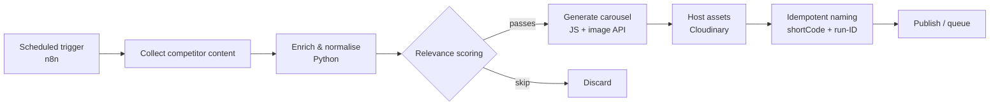

# Architecture

A multi-language automation pipeline that collects competitor content, scores
it for relevance, and produces publish-ready carousel assets. Orchestration
lives in n8n; the heavy lifting is split between Python (data) and JavaScript
(image generation), each containerised so the stages compose cleanly.

## Flow

## Stages

### 1. Collect
An n8n schedule triggers collection of recent competitor posts. Each post is
reduced to a small payload: a short code, source, caption, media URL, timestamp
and engagement counts.

### 2. Enrich (Python)
`enrich.py` normalises captions, extracts hashtags, totals engagement and
computes recency. This turns inconsistent upstream payloads into a uniform
shape the scorer can reason about. Items without a usable media URL are dropped
here rather than failing later.

### 3. Score and select (Python)
`score.py` assigns each item a relevance score in [0, 1] and applies a keep
threshold. The production model is proprietary and is stubbed in this repo with
a transparent engagement-plus-recency baseline so the pipeline runs end to end.
The interface is stable, so swapping the real scorer back in is a drop-in.

### 4. Generate (JavaScript)
`carousel.js` turns each kept item into carousel slides via an image generation
API and uploads them to the asset host. Failures are isolated per item so one
bad slide cannot abort a whole run. Prompt construction is proprietary and
stubbed.

### 5. Idempotent naming
The original pain point. Early runs collided on the asset host because filenames
were not unique across re-runs. `naming.py` keys every filename on the post's
short code plus a per-run identifier (`shortCode__runId__index.ext`), which is
deterministic within a run, unique across runs, and traceable back to both the
source post and the run that produced it.

## Why it is structured this way
- **Language per job.** Python for data shaping and scoring, JavaScript for the
  image API where the SDK ergonomics are better.
- **Stable contracts between stages.** Each stage takes and returns a defined
  shape (`models.py`), so any stage can be tested, swapped or rerun in isolation.
- **Containerised.** Each stage has its own image and they compose via Docker,
  so the pipeline runs the same locally and in n8n's execution environment.
- **Idempotent by design.** Re-running a job is always safe, which matters for a
  scheduled system that will inevitably retry.
